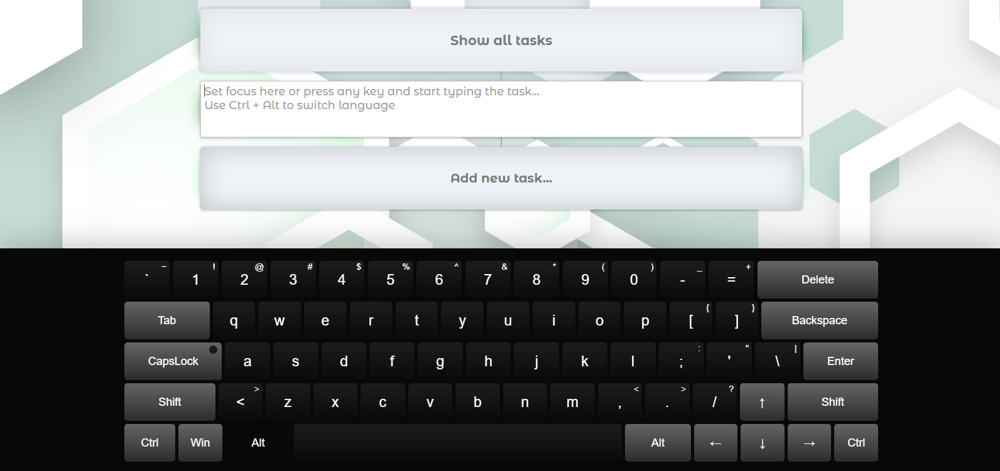

# Virtual Keyboard + ToDo List

[Deploy](https://virtual-keyboard-app1.netlify.app/ "Virtual keyboard")


Technologies used:

+ CSS/SASS
+ JavaScript
+ Webpack

***

## Description
Virtual keyboard support several languages. To switch the language, you need to press **Сtrl+Alt**.
New languages can be easily added as needed using JavaScript.

Using the virtual keyboard, you can add new tasks to the todo list.
Todo list can be viewed by press on the button "Show all task".
The App is adaptive, but the virtual keyboard is hidden for tablets, because the system keyboard appears. 




***
## Getting started:
1. Clone this repo
``` javascript
git clone git@github.com:HL-Dz/virtual-keyboard-app.git
```
2. Install all dependencies
``` javascript
npm ci
```
3. Start dev server
``` javascript
npm run start
```